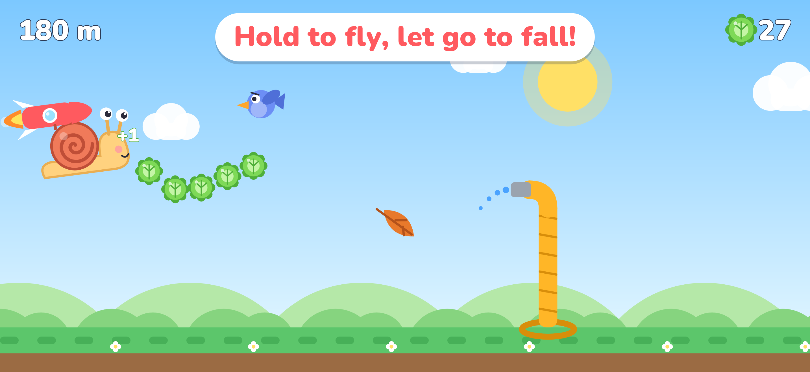

# Rocket Snail 🐌🚀

Мобилна игра за iPhone, iPad и Android. Охлюв с ракета на гърба лети през градината.
Задържаш пръст – лети нагоре. Пускаш – пада. Пазиш се от птици, листа, градински маркучи
и капки дъжд и събираш маруля, с която купуваш шапки и ракети.



## Какво има в играта

- Безкраен полет, скоростта бавно расте; точки = изминати метри.
- Препятствия: птици (и ята), есенни листа, маркучи (от земята, отгоре и „врати“), дъжд.
- Ден → залез → нощ със звезди и луна.
- Флагче „РЕКОРД“ там, където е най-добрият ти полет, и празненство, когато го минеш.
- Магазин: 9 ракети и 8 шапки, купуват се с маруля.
- Музика, звуци, вибрации – всяко се изключва в Настройки.
- Английски и български (сменя се в Настройки).
- Пауза (бутон горе или излизане от приложението), Android бутон „Назад“.
- Всичко е нарисувано и озвучено с код – няма чужди картинки или звуци.

## Как да я пробваш на телефона (Expo Go)

Телефонът и компютърът трябва да са в **една и съща Wi‑Fi мрежа**.

1. Инсталирай **Node.js** (https://nodejs.org → „LTS“).
2. Инсталирай **Expo Go** на телефона (Google Play / App Store).
3. Свали проекта (клона `claude/rocket-snail-mobile-game-s3z068`) и отвори терминал в папката.
4. `npm install` (само първия път, 1–3 минути)
5. `npx expo start`
6. Сканирай QR кода: Android – от Expo Go → „Scan QR code“; iPhone – с камерата.

Не се свързва? Спри с `Ctrl + C` и пусни `npx expo start --tunnel`.

> В Expo Go звукът спира, ако телефонът е на „тих режим“ (iPhone) – това е нарочно.

## Как да я пуснеш в App Store

Виж **[docs/RELEASE.md](docs/RELEASE.md)** – стъпка по стъпка, на български.
Текстовете за магазина са в [store/LISTING.md](store/LISTING.md), а политиката за
поверителност – в [docs/PRIVACY.md](docs/PRIVACY.md).

## Как е подреден кодът

```
App.tsx                  главният файл: шрифтове, звук, запис, смяна на екраните
src/
  game/
    constants.ts         всички настройки: скорост, гравитация, трудност, цветове
    engine.ts            „мозъкът“: движение, препятствия, удари, точки, събития
    draw.ts              рисуването с код (охлюв, шапки, ракети, небе, препятствия, надписи)
    skins.ts             всички ракети и шапки в магазина (имена и цени)
    GameCanvas.tsx       самата игра: екран, пръст, цикъл 60 FPS
    MenuBackdrop.tsx     анимираният фон в менюто
    SnailPreview.tsx     охлювът в магазина
    __tests__/           автоматични проверки на играта
  screens/               Начало (+ Настройки), Игра (+ Пауза, Край), Магазин
  storage/save.ts        запазване на телефона (рекорд, маруля, скинове, настройки)
  i18n/strings.ts        всички текстове (английски + български)
  services/
    sound.ts             музика и звуци
    haptics.ts           вибрации
    ads.ts               място за реклами (AdMob) – сега празно
    purchases.ts         място за покупки – сега празно
  ui/                    бутони, превключватели, икони, шрифт
assets/                  икона, начален екран, звуци (всички генерирани)
store/                   картинки и текстове за App Store и Google Play
scripts/                 програмите, които рисуват иконите/картинките и правят звуците
```

### Лесни промени

- **По-лесно/по-трудно:** `src/game/constants.ts` → `START_SPEED`, `SPEED_GAIN`, `GAP_EASY`, `GAP_HARD`.
- **Цени и имена в магазина:** `src/game/skins.ts`.
- **Текстове / нов език:** `src/i18n/strings.ts`.
- **Нови картинки за магазина/иконата** (след промяна в рисунките): `npm run assets`.
- **Нови звуци/музика:** промени `scripts/make-sounds.mjs` и пусни `npm run sounds`.

### Проверки

```
npm run check     # типове + lint + тестове наведнъж
```

## Технологии

Expo SDK 57 (React Native) + TypeScript, `@shopify/react-native-skia` (графика),
`react-native-reanimated` + `react-native-worklets` (60 FPS цикъл на UI нишката),
`react-native-gesture-handler` (докосване), `expo-audio`, `expo-haptics`,
`AsyncStorage`, шрифт Nunito. Всичко работи в Expo Go.
