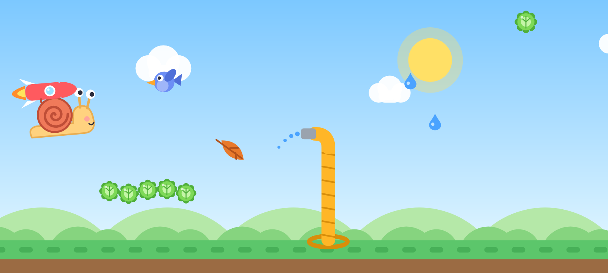

# Rocket Snail 🐌🚀

Мобилна игра за Android и iOS: охлюв с ракета на гърба лети надясно.
Задържаш пръст — лети нагоре. Пускаш — пада. Пазиш се от птици, листа,
градински маркучи и капки дъжд и събираш маруля (монети).



## Как да я пусна на телефона си (Expo Go)

Трябва ти компютър (Windows, Mac или Linux) и телефон в **същата Wi‑Fi мрежа**.

1. **Инсталирай Node.js** на компютъра: https://nodejs.org → бутона „LTS“ → инсталирай с „Next“.
2. **Инсталирай Expo Go** на телефона: от Google Play или App Store (търси „Expo Go“).
3. **Свали проекта** на компютъра:
   - с Git: `git clone https://github.com/me7ko-dev/Rocknet-Snail.git`
     и после `git checkout claude/rocket-snail-mobile-game-s3z068`
   - или от GitHub: зелен бутон „Code“ → „Download ZIP“ (избери първо правилния клон) и разархивирай.
4. **Отвори терминал в папката на проекта**
   (Windows: отвори папката, напиши `cmd` в адресната лента и натисни Enter).
5. Напиши и натисни Enter:
   ```
   npm install
   ```
   (първия път отнема 1–3 минути)
6. После:
   ```
   npx expo start
   ```
   Ще се появи голям QR код.
7. **Сканирай QR кода**:
   - Android: отвори Expo Go → „Scan QR code“.
   - iPhone: отвори обикновената камера и я насочи към кода → натисни жълтото известие.
8. Играта се отваря. Обърни телефона хоризонтално и играй!

**Ако не тръгне:** провери дали телефонът и компютърът са в една и съща Wi‑Fi мрежа.
Ако пак не става, спри с `Ctrl + C` и пусни `npx expo start --tunnel`.

Докато `npx expo start` работи, всяка промяна в кода се появява на телефона веднага.

## Как е подреден кодът

```
App.tsx                 главният файл: зарежда записа и сменя екраните
src/
  game/
    constants.ts        всички настройки: скорост, гравитация, цветове
    engine.ts           „мозъкът“: движение, препятствия, удари, точки
    draw.ts             рисуването с код (охлюв, ракета, птици, листа...)
    GameCanvas.tsx      самата игра: екран, пръст, цикъл 60 FPS
    MenuBackdrop.tsx    анимираният фон в менюто
  screens/
    StartScreen.tsx     начален екран
    GameScreen.tsx      игра + прозорец „Край“ (точки, рекорд, „Пак“)
  storage/save.ts       запазване на рекорд, монети, скинове (AsyncStorage)
  i18n/strings.ts       всички текстове (английски + български)
  services/
    ads.ts              място за рекламите (AdMob) — сега празно
    purchases.ts        място за покупките — сега празно
  ui/Button.tsx         голям сладък бутон
```

### Лесни промени

- **Да е по-лесно/по-трудно:** `src/game/constants.ts` → `START_SPEED`, `SPEED_GAIN`, `GAP_EASY`, `GAP_HARD`.
- **Цвят на ракетата:** `DEFAULT_ROCKET_COLOR` в същия файл.
- **Текстове / превод:** `src/i18n/strings.ts`. Бутонът „БГ/EN“ в менюто сменя езика.

## Технологии

Expo SDK 57 (React Native) + TypeScript, `@shopify/react-native-skia` за графиката,
`react-native-reanimated` + `react-native-worklets` за 60 FPS цикъла,
`react-native-gesture-handler` за докосването, `AsyncStorage` за записа.
